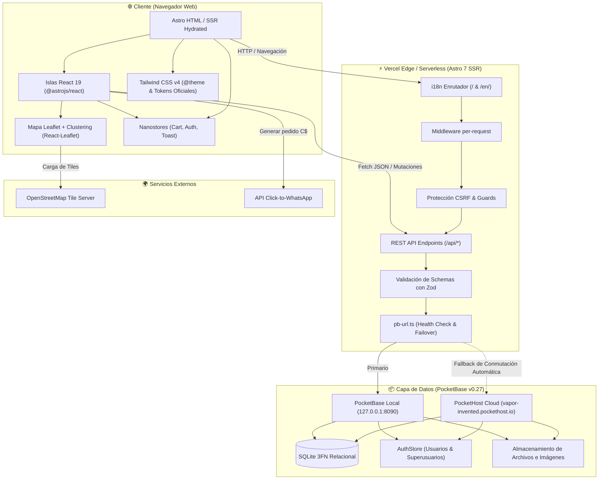
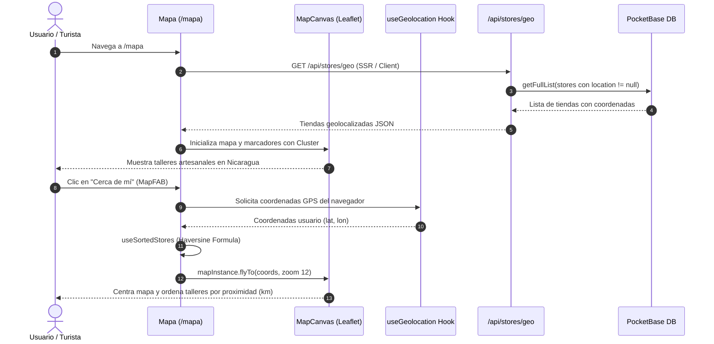
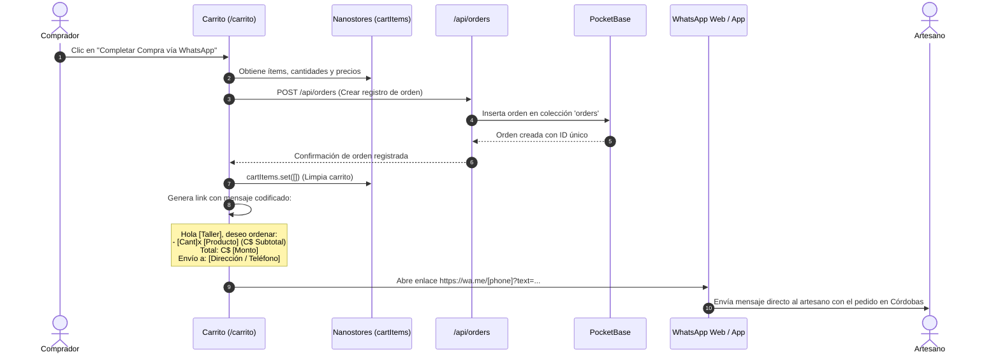

# Arquitectura del Sistema y Flujos de Datos — ArtesaNica

Este documento especifica la arquitectura de componentes, flujo de datos y secuencias de interacción para la plataforma **ArtesaNica** (Astro 7 + React 19 + PocketBase + Tailwind v4 + Leaflet).

---

## 🏛️ 1. Arquitectura General del Sistema

---

## 🗺️ 2. Diagrama de Secuencia: Exploración y Geolocalización de Talleres

---

## 🛒 3. Diagrama de Secuencia: Checkout y Pedido Directo a WhatsApp

