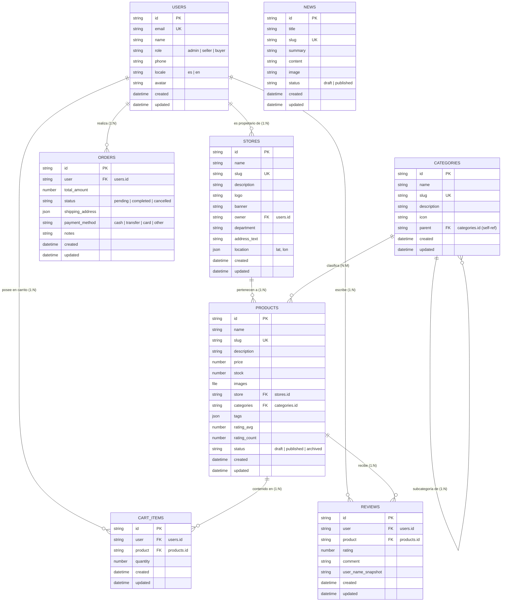

# Modelo Entidad-Relación (3FN) — ArtesaNica

Este documento contiene la especificación y diagramación formal del Modelo Entidad-Relación en Tercera Forma Normal (3FN) para la base de datos de **ArtesaNica** en PocketBase, como parte de los entregables técnicos de desarrollo del **Hackathon Nicaragua 2026**.

---

## 📐 Diagrama ER (Mermaid)

---

## 📊 Justificación de Tercera Forma Normal (3FN)

1. **Primera Forma Normal (1FN)**:
   - Todos los atributos son atómicos. No existen listas repetitivas de atributos multivaluados en tablas relacionales primarias. Los archivos e imágenes se manejan en campos dedicados de PocketBase.
2. **Segunda Forma Normal (2FN)**:
   - Cumple con 1FN y todos los atributos no clave dependen totalmente de la clave primaria única (`id`) de cada entidad.
3. **Tercera Forma Normal (3FN)**:
   - Cumple con 2FN y no existen dependencias transitivas entre atributos no clave. Por ejemplo, los datos del usuario (`users`) no se duplican en las tiendas ni en las órdenes, manteniendo referencias por clave foránea (`owner`, `user`).

---

## 🛠️ Colecciones y Relaciones

| Colección | Descripción | Relaciones Clave |
|-----------|-------------|------------------|
| **`users`** | Usuarios registrados (compradores, artesanos, admins) | `STORES`, `ORDERS`, `CART_ITEMS`, `REVIEWS` |
| **`stores`** | Tiendas/Talleres artesanales | Propietario (`users.id`), Productos (`products.id`) |
| **`categories`** | Categorías de artesanías | Auto-referencial (`parent`), Productos (`products.id`) |
| **`products`** | Catálogo de productos artesanales | Pertenece a `stores.id`, Categorías `categories.id` |
| **`cart_items`** | Ítems del carrito de compras | Pertenece a `users.id` y `products.id` |
| **`orders`** | Registro de órdenes de compra | Pertenecen a `users.id` |
| **`reviews`** | Valoraciones de productos | Relaciona `users.id` con `products.id` |
| **`news`** | Publicaciones y noticias del portal | Independiente con filtro de estado |

---

## 🔐 Reglas de Seguridad y Acceso por Rol (Rules & Security)

- **Lectura Pública (`listRule` / `viewRule`)**:
  - `categories`, `stores`, `products` (solo publicados), `news` (solo publicadas) y `reviews` son de acceso público sin autenticación.
- **Acceso Restringido por Rol (`createRule` / `updateRule` / `deleteRule`)**:
  - `orders` y `cart_items`: Acceso exclusivo al usuario propietario autenticado (`@request.auth.id = user`).
  - `stores` y `products`: Edición permitida al artesano propietario (`store.owner = @request.auth.id`) o administradores.
