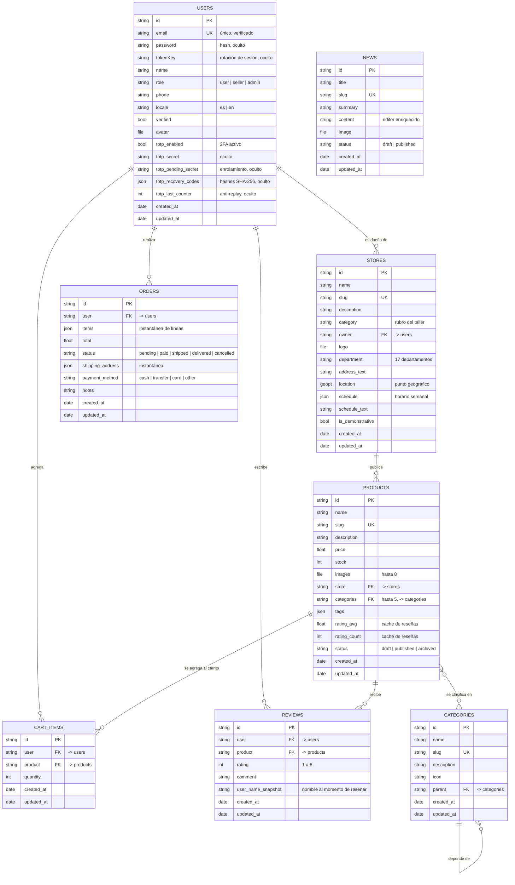
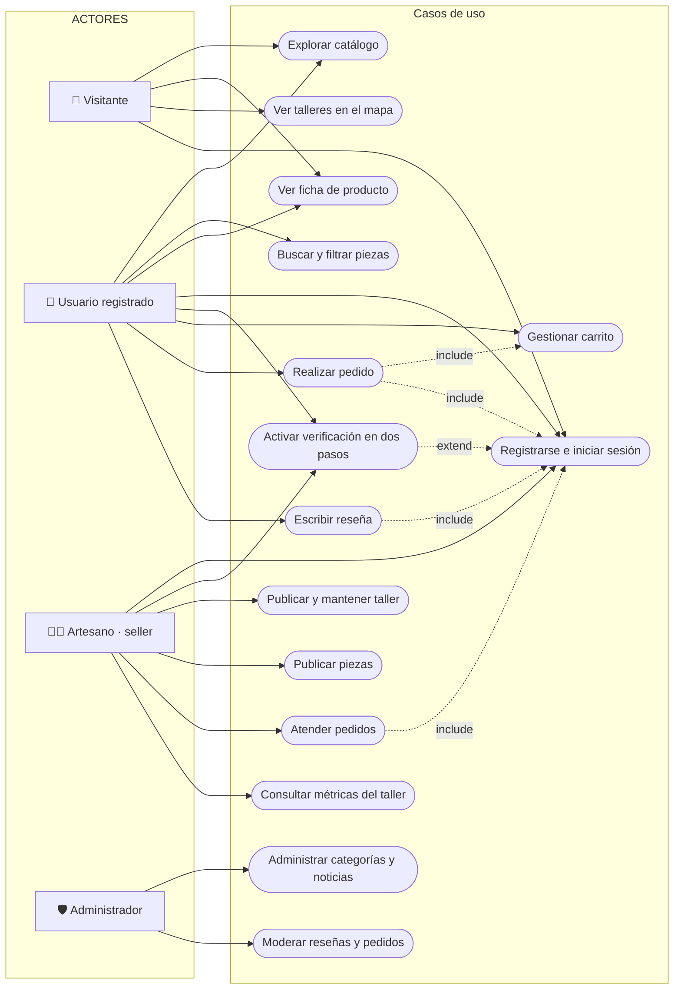
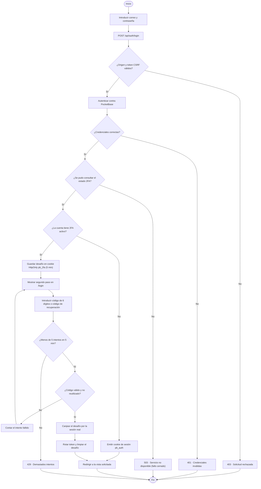
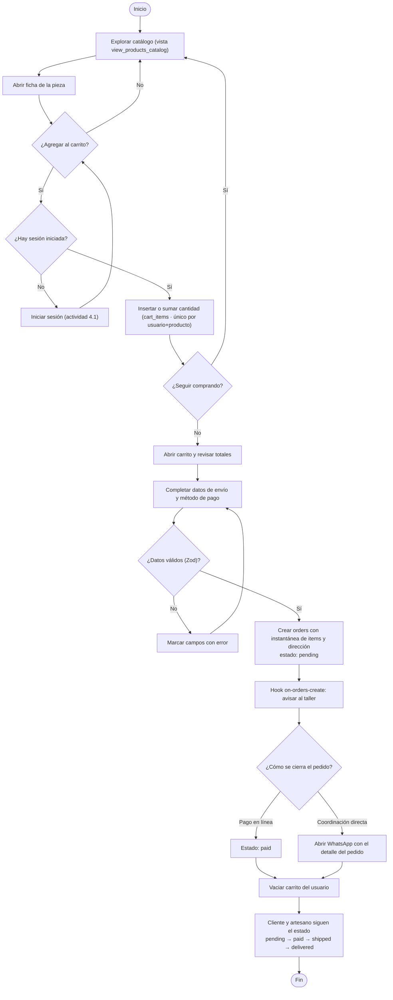
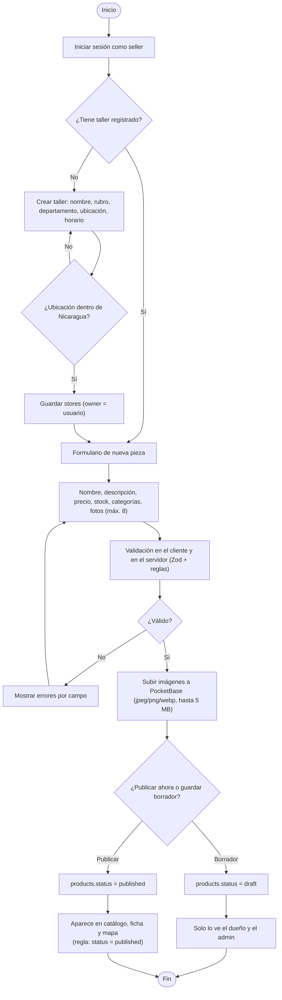
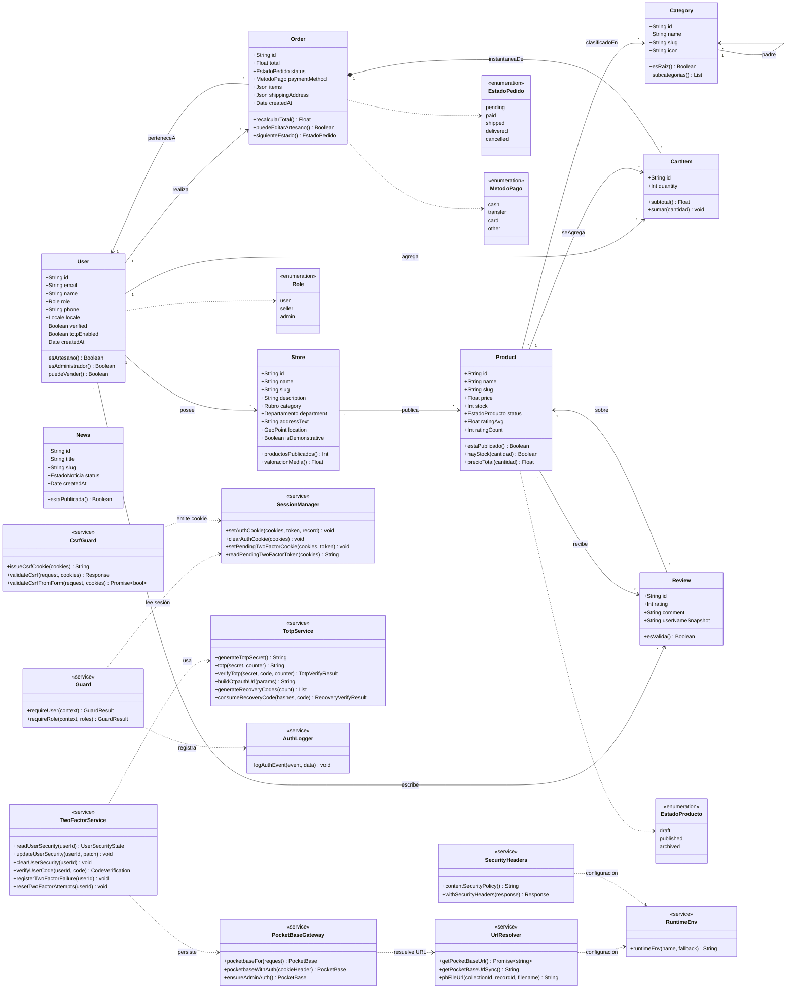
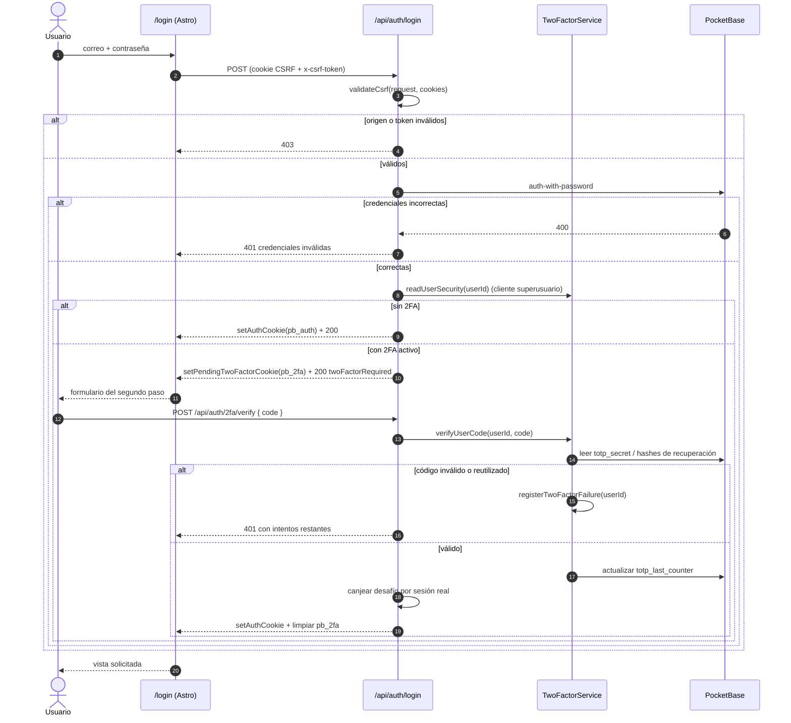

# Entregable 2 — Diagramación de Base de Datos y UML

**Proyecto:** ArtesaNica · marketplace de artesanía nicaragüense
**Hackathon Nicaragua 2026**
**Motor de datos:** PocketBase 0.27.2 (SQLite) · frontend Astro 7 con SSR
**Fecha de esta revisión:** 2026-10-08

---

## Ficha del entregable

| Punto del requisito | Dónde está |
| :--- | :--- |
| Modelo Entidad-Relación normalizado (3FN) | [§2](#2-modelo-entidad-relación-3fn) |
| Diagramas UML: **Casos de Uso** | [§3](#3-uml-1--diagrama-de-casos-de-uso) |
| Diagramas UML: **Actividades** | [§4](#4-uml-2--diagramas-de-actividades) |
| Diagramas UML: **Clases** | [§5](#5-uml-3--diagrama-de-clases) |
| Extra: **Secuencia** del login con 2FA | [§6](#6-extra--diagrama-de-secuencia-login-con-2fa) |
| Cómo visualizar los diagramas | [§7](#7-cómo-visualizar-estos-diagramas) |

**Criterio de verdad de este documento:** el modelo ER **no está dibujado a mano**.
Se generó leyendo el esquema **real en vivo** de la base (`_collections`, `_migrations`,
índices y reglas de acceso de PocketBase) el 2026-10-08. Los conteos de registros
que aparecen son los reales de ese momento.

---

## 1. Resumen del modelo

- **8 colecciones de negocio** (más las de sistema de PocketBase: `_superusers`,
  `_authOrigins`, `_externalAuths`, `_mfas`, `_otps`).
- **3 vistas SQL** de solo lectura para consultas agregadas del catálogo y del mapa.
- **9 relaciones** con integridad referencial declarada (3 de ellas con borrado en cascada).
- **17 índices**, de los cuales **8 son únicos**: 6 de identidad funcional (`email`, `slug` de cada entidad) y 2 compuestos de regla de negocio (un carrito y una reseña por usuario y producto).
- **Reglas de acceso por rol** en las 8 colecciones (nada queda abierto de más).

| Entidad | Propósito | Campos | Registros hoy |
| :--- | :--- | ---: | ---: |
| `users` | Cuentas con rol `user` / `seller` / `admin` + estado 2FA | 20 | 11 |
| `stores` | Talleres artesanos, con ubicación y horario | 15 | 6 |
| `products` | Piezas publicadas por cada taller | 15 | 8 |
| `categories` | Categorías jerárquicas del catálogo | 8 | 1 |
| `orders` | Pedidos con instantánea de las líneas | 10 | 16 |
| `cart_items` | Carrito persistente por usuario | 6 | 0 |
| `reviews` | Reseñas y valoración por producto | 8 | 1 |
| `news` | Noticias y contenido editorial | 9 | 0 |

---

## 2. Modelo Entidad-Relación (3FN)

### 2.1 Diagrama ER

### 2.2 Relaciones, cardinalidad e integridad

| # | Relación | Cardinalidad | FK | Borrado en cascada | Regla de negocio |
| :-- | :--- | :--- | :--- | :--: | :--- |
| 1 | `users` → `stores` | 1 : N | `stores.owner` | **Sí** | Un taller pertenece a un artesano; si se borra la cuenta, se borra el taller. |
| 2 | `users` → `orders` | 1 : N | `orders.user` | **No** | El histórico de pedidos se conserva aunque se borre la cuenta (integridad contable). Es la razón por la que el borrado se bloquea con *required relation*. |
| 3 | `users` → `cart_items` | 1 : N | `cart_items.user` | **Sí** | El carrito es datos de sesión persistida. |
| 4 | `users` → `reviews` | 1 : N | `reviews.user` | **Sí** | La reseña es autoría de quien la escribió. |
| 5 | `stores` → `products` | 1 : N | `products.store` | **Sí** | Una pieza existe dentro de un taller. |
| 6 | `products` → `cart_items` | 1 : N | `cart_items.product` | **Sí** | Si la pieza desaparece, sale del carrito. |
| 7 | `products` → `reviews` | 1 : N | `reviews.product` | **Sí** | Las reseñas no sobreviven a la pieza. |
| 8 | `products` ↔ `categories` | N : M | `products.categories` (hasta 5) | No | Una pieza puede estar en varias categorías (evita duplicar fichas). |
| 9 | `categories` → `categories` | 1 : N | `categories.parent` | No | Jerarquía autorreferente (tipo → subtipo). |

### 2.3 Índices y restricciones de unicidad

| Índice | Tipo | Para qué |
| :--- | :--- | :--- |
| `idx_email__pb_users_auth_` | Único | Identidad de la cuenta (`email`), solo si no está vacío. |
| `idx_tokenKey__pb_users_auth_` | Único | Rotación de token de sesión. |
| `idx_categories_slug` | Único | URL estable `/categoria/{slug}`. |
| `idx_products_slug` | Único | URL estable `/productos/{slug}`. |
| `idx_stores_slug` | Único | URL estable `/tiendas/{slug}`. |
| `idx_news_slug` | Único | URL estable `/noticias/{slug}`. |
| `idx_cart_user_product` | Único compuesto | **Regla de negocio:** un solo renglón por (usuario, producto); la cantidad vive en `quantity`. |
| `idx_reviews_user_product` | Único compuesto | **Regla de negocio:** una reseña por usuario y producto. |
| `idx_products_status_price` | Compuesto | Ordenar/filtrar el catálogo publicado por precio sin escanear toda la tabla. |
| `idx_products_status`, `idx_products_store` | Simple | Filtro por estado y por taller. |
| `idx_orders_status`, `idx_orders_user` | Simple | Panel de pedidos por estado y por cliente. |
| `idx_reviews_product` | Simple | Cálculo de la valoración media de una pieza. |
| `idx_stores_department`, `idx_stores_is_demonstrative` | Simple | Mapa por departamento y separación de datos de demostración. |
| `idx_news_status` | Simple | Solo las noticias publicadas. |

> Total contabilizado en el esquema en vivo: **17 índices** (8 únicos) en las 8 colecciones de negocio. La tabla agrupa varios índices por finalidad.

### 2.4 Normalización 1FN · 2FN · 3FN

**1FN — atributos atómicos.** Ninguna tabla guarda listas separadas por comas en
campos escalares: lo que es multivaluado se modela aparte (`cart_items`, `reviews`)
o con el tipo `file`/`json` del motor, que almacena la colección de forma
estructurada (`products.images`, `products.tags`, `stores.schedule`). No hay campos
repetidos tipo `imagen1`, `imagen2`.

**2FN — dependencia funcional completa de la clave.** Todas las tablas usan clave
primaria simple (`id` de 15 caracteres que genera PocketBase), así que no existe un
atributo que dependa solo de parte de una clave compuesta. Las dos claves
compuestas que sí existen son **restricciones de unicidad**, no claves primarias:

- `cart_items (user, product)` → `quantity` depende de la pareja completa
  (el mismo producto en dos carritos distintos tiene cantidades distintas).
- `reviews (user, product)` → `rating`, `comment` dependen de la pareja completa.

**3FN — sin dependencias transitivas.** Los atributos derivables no se almacenan
como fuente de verdad:

- `stores.total_products`, `stores.rating_avg`, `stores.total_reviews`,
  `categories.total_stores`, `categories.min_price`… **no existen como columnas**:
  se calculan en las vistas `view_stores_directory`, `view_category_stats` y
  `view_products_catalog` (ver §2.5). Así el conteo nunca puede quedar desfasado.
- `products.store_name`, `products.store_department`, `products.category_name`
  tampoco se copian en `products`: se resuelven por JOIN en la vista del catálogo
  (evita la dependencia transitiva `producto → taller → departamento`).

**Desnormalizaciones conscientes (documentadas y justificadas).** Romper 3FN solo
donde el costo de recalcular supera al de mantener el dato:

| Campo | Tipo | Por qué se acepta |
| :--- | :--- | :--- |
| `products.rating_avg`, `products.rating_count` | *caché agregado* | Se recalculan en cada alta/baja de reseña mediante el hook `pb_hooks/on-reviews-change.pb.js`. Sirven listados y ordenaciones sin agregar en cada lectura. La fuente de verdad sigue siendo `reviews`. |
| `orders.items` y `orders.shipping_address` (JSON) | *instantánea histórica* | Un pedido debe conservar el precio y la dirección **del momento de la compra**. Si el artesano cambia el precio o el cliente cambia su dirección, el pedido no debe mutar. Es una decisión de negocio, no una omisión. |
| `orders.total` | *caché* | Se congela junto con la instantánea para auditoría y para las métricas del panel. |
| `reviews.user_name_snapshot` | *instantánea* | La reseña muestra el nombre tal como estaba al escribirla; evita JOIN y evita que un cambio de nombre reescriba el historial. |
| `stores.is_demonstrative` | *bandera* | Separa datos de demostración de datos reales sin duplicar tablas. |
| `users.totp_*` (5 campos) | *estado de seguridad* | Campos `hidden`: solo el cliente de superusuario los lee/escribe, así que un `PATCH` normal del usuario no puede falsear el 2FA. |

### 2.5 Vistas SQL (datos derivados, siempre consistentes)

| Vista | Rol en la aplicación | Lee de |
| :--- | :--- | :--- |
| `view_products_catalog` | Catálogo con nombre/slug/departamento del taller y de la categoría + `rating_avg` recalculado; alimenta `/productos`. | `products` ⋈ `stores` ⋈ `categories` ⋈ `reviews` |
| `view_stores_directory` | Directorio de talleres con `total_products`, `rating_avg` y `total_reviews` reales; alimenta `/tiendas` y el mapa. | `stores` ⋈ `products` ⋈ `reviews` |
| `view_category_stats` | Conteo de talleres y rango de precios por categoría; alimenta la portada. | `categories` ⋈ `stores` ⋈ `products` |

Las tres son **de solo lectura** y reproducen la misma lógica que usaría un
`GROUP BY`, con el filtro `p.status = 'published'` incorporado: nunca exponen
borradores ni piezas archivadas.

### 2.6 Reglas de acceso por colección

PocketBase aplica las reglas en el servidor, así que ninguna API puede saltarlas
(el frontend no necesita comprobarlas para estar protegido).

| Colección | list / view | create | update | delete |
| :--- | :--- | :--- | :--- | :--- |
| `users` | propio usuario (`id = @request.auth.id`) | abierto (registro) | propio usuario | propio usuario |
| `stores` | público | `seller` o `admin` | dueño o `admin` | dueño o `admin` |
| `products` | publicadas o `admin` o dueño del taller | `seller` o `admin` | `admin` o dueño del taller | `admin` o dueño del taller |
| `categories` | público | `admin` | `admin` | `admin` |
| `orders` | el cliente dueño, el `seller` implicado o `admin` | autenticado | `admin`, o `seller` mientras no esté `paid` | `admin` |
| `cart_items` | solo el dueño | autenticado | solo el dueño | solo el dueño |
| `reviews` | público | autenticado | autor | autor o `admin` |
| `news` | solo `status = 'published'` | `admin` | `admin` | `admin` |

---

## 3. UML 1 — Diagrama de Casos de Uso

> Mermaid no tiene un tipo de diagrama de casos de uso propio; se representa con el
> estándar de facto en la herramienta: actores como nodos y casos de uso como elipses
> (`([…])`), con asociaciones hacia lo que cada actor puede hacer.

**Actores y permisos (según las reglas reales de §2.6):**

- **Visitante** — todo lo público: catálogo, ficha de pieza, directorio de talleres y mapa.
- **Usuario registrado** (`role = user`) — además: carrito, pedidos, reseñas y 2FA.
- **Artesano** (`role = seller`) — además: su taller, sus piezas, sus pedidos y sus métricas.
- **Administrador** (`role = admin`) — categorías, noticias, moderación y acceso total.

---

## 4. UML 2 — Diagramas de Actividades

### 4.1 Inicio de sesión con verificación en dos pasos (2FA)

### 4.2 Compra: del carrito al pedido

### 4.3 Publicación de una pieza (artesano)

---

## 5. UML 3 — Diagrama de Clases

Modelo de clases del dominio (espejo de las colecciones) más las clases de servicio
que ya existen en el código (`src/lib`), con los métodos reales.

---

## 6. Extra — Diagrama de Secuencia: login con 2FA

(Complementa al Entregable 2 con el flujo entre capas; los diagramas de secuencia de
la arquitectura general están en `docs/DIAGRAMA_ARQUITECTURA.md`.)

---

## 7. Cómo visualizar estos diagramas

Los bloques marcados con el lenguaje `mermaid` se renderizan directamente en:

| Herramienta | Cómo |
| :--- | :--- |
| **GitHub / GitLab** | Al ver este `.md` en el repositorio, los diagramas se dibujan solos. |
| **VS Code** | Extensión *Markdown Preview Mermaid Support* (vista previa con `Ctrl+Shift+V`). |
| **mermaid.live** | Pegar cada bloque para editar y **exportar SVG/PNG**. |
| **CLI (para el PDF/documento)** | `npx -y @mermaid-js/mermaid-cli -i este.md -o diagramas.pdf` (o `-i bloque.mmd -o pieza.png`). |
| **Word** | Exportar a PNG/SVG desde mermaid.live e insertar; las tablas del §2 se pegan tal cual. |

---

## 8. Trazabilidad y mantenimiento

- **Fuente del modelo ER:** esquema en vivo de la base (`_collections`: campos, tipos,
  `required`, `hidden`, relaciones, `cascadeDelete`, índices y reglas) e historial de
  migraciones versionadas en `pb/pb_migrations/` (25 archivos, de `1700000000` a
  `1700000024`). Si el esquema cambia, se añade una migración; este documento se
  regenera igual.
- **Fuente de los diagramas UML:** flujos reales del código (`src/middleware.ts`,
  `src/pages/api/auth/*`, `src/lib/auth/*`, `src/components/pages/*`) y las reglas de
  acceso de §2.6.
- **Coherencia con el resto de la entrega:**
  - `docs/DIAGRAMA_ER.md` — versión resumida del ER para el README.
  - `docs/DIAGRAMA_ARQUITECTURA.md` — arquitectura y secuencias de mapa/checkout.
  - `docs/ENTREGABLES_HACKATHON.docx` — documento Word con los 6 entregables (sección 2).
  - `DESIGN.md` — tokens de color y tipografía usados en las pantallas de estos flujos.
